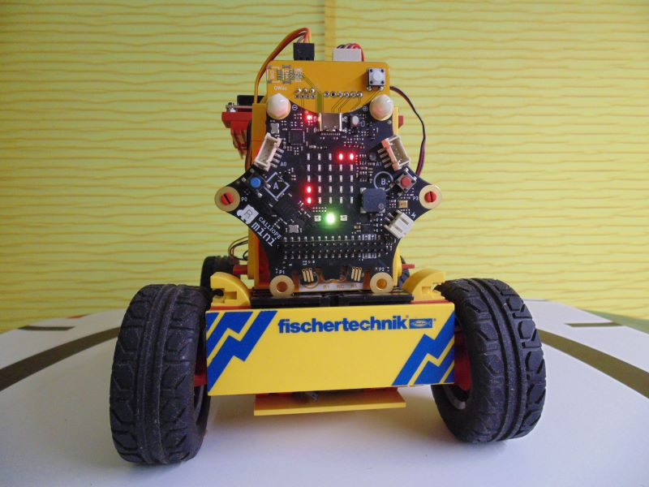
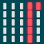

> Diese Seite bei [https://calliope-net.github.io/fernsteuerung-mkc-e63/](https://calliope-net.github.io/fernsteuerung-mkc-e63/) öffnen

#### Hardware: Modell

* **[Maker Kit Car](https://www.fischertechnik.de/de-de/maker#maker-kit-car)** \| [digitale Bauanleitung](https://apps.fischer.de/ecom/fischertechnik/digitale-bauanleitungen/maker-kit-car.htm)
* **[Calliope mini 3](https://calliope.cc/calliope-mini/calliope-mini-3)** \| [Leiterplatte für Calliope mini 3 Pinleiste](https://forum.calliope.cc/t/mit-angesteckter-leiterplatte-wird-calliope-v3-zum-controller-fuer-fischertechnik-modelle/2913)
* optional [Qwiic Ultrasonic Distance Sensor](https://learn.sparkfun.com/tutorials/qwiic-ultrasonic-distance-sensor-hc-sr04-hookup-guide)
* optional [IR-Spursensor](https://www.fischertechnik.de/de-de/produkte/einzelteile/sensoren/128598-ir-spursensor-schwarz)

MakeCode Projekt: **[calliope-net/fernsteuerung-mkc-e63](https://calliope-net.github.io/fernsteuerung-mkc-e63/)**

#### Hardware: Fernbedienung

* **Calliope mini** v1 v2 v3
* optional [SparkFun Qwiic Joystick](https://learn.sparkfun.com/tutorials/qwiic-joystick-hookup-guide)

MakeCode Projekt: **[calliope-net/fernsteuerung-s61](https://calliope-net.github.io/fernsteuerung-s61/)**

### Bedienung Maker Kit Car (ohne Fernsteuerung)

* nach dem Einschalten wird die Funkgruppe und Servo Korrektur angezeigt

* Servo Korrektur
  * Winkel am Servo Pin, bei dem das Modell geradeaus fährt
  * im Bild rechts wird die Binärzahl 95 (°) angezeigt
  * um den Winkel zu ändern **A+B halten**
  * danach mit **A halten** oder **B halten** den Wert ändern
  * wird im Flash gespeichert und beim Einschalten wieder hergestellt
  * Servo Korrektur beenden mit Reset, neuer Wert muss angezeigt werden
* **A geklickt**
  * schaltet *Hindernis ausweichen* an und aus (Ultraschall Sensor)
  * Modell fährt geradeaus und lenkt vor einem Hindernis rückwärts
* **B geklickt**
  * schaltet *Spur folgen* an und aus (2 Spur Sensoren)
  * fährt bis zu einer schwarzen Linie (etwa 2 cm breit) dann auf der Linie
  * mit A kann Ultraschall Sensor dazu geschaltet werden (gelbe LED)
  * hält dann auf der Line bei Hindernis an (wenn mehrere Modelle fahren)
* **A+B geklickt**
  * fährt 6 Strecken (mit Encoder zentimetergenau)
  * wenn A und B aus war: Ultraschall Sensor nicht aktiv
  * wenn *Hindernis ausweichen* gestartet war: Ultraschall Sensor aktiv
    * bei Hindernis: Abbruch und weiter mit der nächsten Strecke
  * endet, wenn alle Strecken gefahren sind; kann nur mit Reset unterbrochen werden
  * Strecken können mit Blöcken selbst programmiert werden
  * die Länge wird mit Encoder in cm und ohne Encoder in Zehntelsekunden angegeben
  1. nach rechts fahren und lenken
  2. die selbe Strecke zurück
  3. geradeaus
  4. Kreis nach links
  5. Kreis nach rechts
  6. gerade zurück
* **RGB-LED** (Calliope)
  * rot blinken: keine Bluetooth Verbindung
  * grün: lokales Programm gestartet mit **A geklickt**, **B geklickt**, **A+B geklickt**
  * blau blinken: Fernbedienung mit gleicher Funkgruppe verbunden
* **Timeout**
  * rot blinken: nach 30 Sekunden *zurücksetzen*
  * grün: nach 30 Sekunden ohne Sensor-Ereignis *zurücksetzen*
  * blau blinken: kein Timeout (Modell ist ferngesteuert)
  * Modelle mit Relais werden beim *zurücksetzen* aus geschaltet
  * *zurücksetzen* kann auch von der Fernbedienung gesendet werden

> Timeout sorgt dafür, dass das Modell stehen bleibt, wenn beim fernsteuern die Bluetooth Verbindung unterbrochen ist
> oder das Modell beim alleine fahren stecken bleibt.

### Bedienung Maker Kit Car (mit Fernsteuerung)

> Bei Sender und Empfänger muss die selbe Funkgruppe eingestellt sein.

Das Ändern der Funkgruppe funktioniert beim Modell und der Fernbedienung gleich. **Knopf A** oder **Knopf B** muss so lange gedrückt werden, 
bis sich die Anzeige ändert (etwa 4 Sekunden). Ändern der Funkgruppe ist in jedem Zustand möglich.

* **Funkgruppe 1-8** ist die Anzahl der roten LED in den 2 linken Spalten im Display
  *  **A halten** (-1)
  *  **B halten** (+1)

       

Beim Sender kann **nach** der Funkgruppe das Modell geändert werden, welches mit der Fernbedienung gesteuert werden soll.
Das Modell wird als Bild angezeigt. 

    

Calli:Bot ist das erste Bild. Das Modell und die Funkgruppe werden beim Einschalten der Fernbedienung (Sender) aus dem Flash wieder hergestellt und angezeigt.
Wird nicht das Calli:bot Bild angezeigt, kann es mit **A geklickt** (kurz drücken) wieder eingestellt werden.

> Sind mehrere Fernbedienungen im Einsatz, reagiert ein Calli:bot immer nur auf die Fernbedienung, die zuerst da war.
> (Von der das erste Bluetooth Datenpaket empfangen wurde.) Nach Reset wird neu entschieden.

#### Fahren und Lenken - eine Fernbedienung mit Joystick - ein Modell

 

In der Betriebsart *Fahren und Lenken* ist immer eine Fernbedienung mit Joystick erforderlich und eine aktive Bluetooth Funkverbindung.

* **A+B geklickt** startet die Bluetooth Funkverbindung; RGB-LED blinkt blau
  * während der Verbindung zeigen Sender und Empfänger die gleichen Daten an
  * in Joystick Ruhestellung leuchten rechts oben 2 LED (Binärzahl 16)[1]
  * dieser Binär-Wert wird vorwärts größer[2] und rückwärts kleiner[3]
  * beim Lenken wird der Wert rechts größer[4] und links kleiner[5]

1 2 3 4 5

* jetzt kann mit dem Joystick ferngesteuert werden *Fahren und Lenken*
  * **A geklickt** schaltet Ultraschall Sensor an und aus (gelbe LED links)
    * fährt bei Hindernis (rot) nicht mehr vorwärts; muss rückwärts fahren
  * **B geklickt** schaltet Spur Sensor an und aus (weiße LED rechts)
    * bleibt auf einer schwarzen Linie stehen; aus schalten mit **B geklickt**
    * hier kann aber auch auf die Funktion *Spur folgen* umgeschaltet werden
  * **auf den Joystick drücken** hupen

#### Programm fernstarten - eine Fernbedienung - mehrere (verschiedene) Modelle

 

Es ist sinnvoll das Modell vorher mit *Fahren und Lenken* an die Position zu fahren, wo das Programm gestartet werden soll. 

* **A+B geklickt** schaltet auf *Programm fernstarten*

In der Betriebsart *Programm fernstarten* wird der Joystick nicht benutzt. 

Die Programme *Hindernis ausweichen* oder *Spur folgen* werden mit der Fernbedienung auf dem verbundenen Modell gestartet und laufen dann dauerhaft weiter,
bis sie wieder mit der Fernbedienung beendet werden.

Die Fernbedienung kann die Funkgruppe ändern und den nächsten Call:bot (oder ein anderes Modell) fernsteuern.
Währenddessen fahren die gestarteten Modelle allein weiter (RGB-LED grün). Die Funkgruppe kann jederzeit auf ein Modell zurück geschaltet werden.
Den Zustand jedes Modells hat sich die Fernbedienung gemerkt, so dass dieses weiter fährt, blau blinkt und mit den Tasten gesteuert werden kann.

> Um ein stecken gebliebenes Modell mit dem Joystick zu fahren, kann jederzeit auf *Fahren und Lenken* umgeschaltet werden. Mehrere Modelle
> können - ohne sie anzufassen - mit einer einzigen Fernbedinung gesteuert werden.

* nur wenn B aus ist: **A geklickt**
  * schaltet Programm *Hindernis ausweichen* an und aus (Ultraschall Sensor)
  * Modell fährt geradeaus und lenkt vor einem Hindernis rückwärts
* nur wenn A aus ist: **B geklickt**
  * schaltet Programm *Spur folgen* an und aus (2 Spur Sensoren)
  * fährt bis zu einer schwarzen Linie (etwa 2 cm breit) dann auf der Linie
  * mit **A geklickt** kann Ultraschall Sensor dazu geschaltet werden (gelbe LED)
  * hält dann auf der Line bei Hindernis an (wenn mehrere Modelle fahren)

#### Strecken senden - 5 Teilstrecken: (Fahren, Lenken, Länge)

 

Es ist sinnvoll das Modell vorher mit *Fahren und Lenken* an die Position zu fahren, wo es dann los fahren soll. 

* **A+B geklickt** schaltet auf *Strecken senden*

In der Betriebsart *Strecken senden* werden maximal 5 Strecken nacheinander abgefahren und können mit der Fernbedienung nicht unterbrochen werden.
Nur der Ultraschall Sensor kann eine Strecke abbrechen, wenn ein Hindernis im Weg ist.

Auf vielen Calliope (Klassensatz) ohne Joystick können mit Blöcken die Strecken programmiert, und dann einzeln zu einem Modell gesendet werden.
Die Länge wird mit Encoder in Zentimeter und ohne Encoder in Zehntelsekunden gemessen. 
Ohne Encoder hängt die Länge einer Strecke u.a. von der Batterie Spannung ab und ist sehr ungenau.

* **A geklickt** fährt 5 Strecken
  1. nach rechts fahren und lenken
  2. die selbe Strecke zurück
  3. geradeaus
  4. Kreis nach links
  5. gerade zurück

* **B geklickt** fährt geradeaus und viertel Drehung 8 mal hintereinander
  * mit drehen auf der Stelle soll ein Quadrat zweimal gefahren werden
  * damit kann gezeigt werden, wie ein Encoder funktioniert
  * ist nur bei Modellen mit 2 Rädern und 2 Motoren möglich

#### Fahren und Lenken

 

* **A+B geklickt** schaltet zurück auf *Fahren und lenken*
  * dabei wird zur Kontrolle kurz das Modell Bild angezeigt
  * jetzt kann wieder mit dem Joystick ferngesteuert werden

#### Reset zum Modell senden

* **A+B halten** sendet Reset zum Modell und seinem Calliope
  * die Fernbedienung ist wieder bei der Auswahl des Modells (Bilder)

## Dieses Projekt bearbeiten 

Um dieses Repository in MakeCode zu bearbeiten.

* öffne [https://makecode.calliope.cc/](https://makecode.calliope.cc/)
* klicke auf **Importieren** und dann auf **Importiere URL**
* füge **calliope-net/fernsteuerung-mkc-e63** ein und klicke auf Importieren

#### Metadaten (verwendet für Suche, Rendering)

* for PXT/calliopemini

